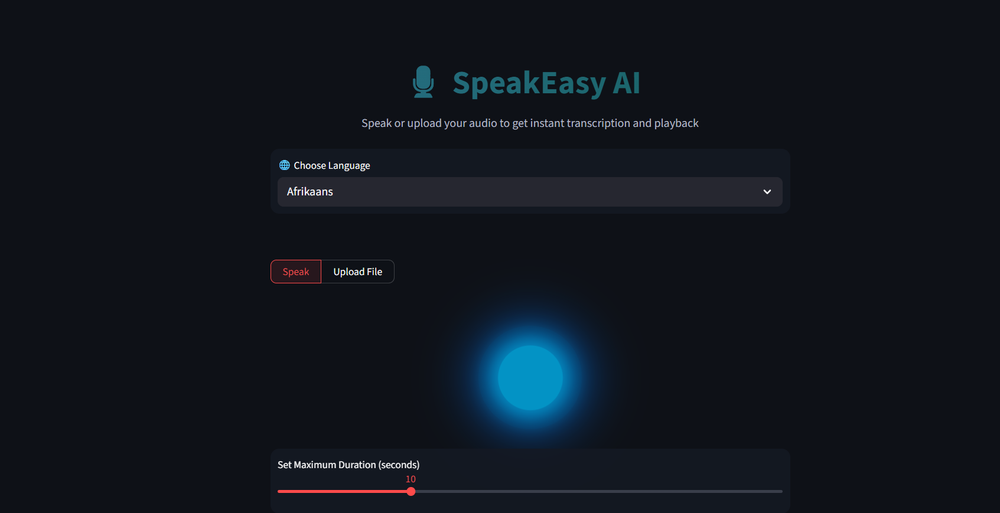

# 🎙️ SpeakEasy AI



> **SpeakEasy AI** is a modern, multilingual speech-to-text converter built with **Python** and **Streamlit**, powered by **OpenAI Whisper** for accurate real-time transcription.

---

## 🚀 Features

- 🎧 **Record Audio** using your microphone directly from the app  
- 📂 **Upload Audio Files** (`.wav`, `.mp3`, `.m4a`) for transcription  
- 🌍 **Multilingual Support** — transcribe speech in 100+ languages  
- 🧠 **AI Transcription** using Whisper model (`tiny`, `base`, `small`, `medium`, `large`)  
- 📝 **Download Reports** including language, method, and timestamp metadata  
- 💾 **Re-record Option** for incorrect recordings  
- ⚡ **Modern UI** — dark theme, centered controls, gradient text, and glowing microphone animation  

---

## 🧱 Project Structure

```
Speech-Text/
│
├── main.py                   
├── modules/
│   ├── ui.py                 
│   ├── record.py             
│   ├── transcribe.py         
│   ├── files.py              
│
└── assets/
    └── styles.css            
```

---

## 🛠️ Installation

1. **Clone the repository**
   ```bash
   git clone https://github.com/Mamoonkhan11/Speech-Text
   cd Speech-Text
   ```

2. **Create a virtual environment**
   ```bash
   python -m venv .venv
   .venv\Scripts\activate      # On Windows
   source .venv/bin/activate     # On macOS/Linux
   ```

3. **Install dependencies**
   ```bash
   pip install -r requirements.txt
   ```

4. **Install FFmpeg (Required for Whisper)**
   - Windows: `choco install ffmpeg`
   - macOS: `brew install ffmpeg`
   - Linux: `sudo apt install ffmpeg`

5. **Run the app**
   ```bash
   streamlit run main.py
   ```

---

## 🧠 Model Selection

You can change the Whisper model in `modules/transcribe.py`:

```python
# choices: tiny, base, small, medium, large
model = whisper.load_model("base")
```

| Model | Speed | Accuracy | Notes |
|--------|--------|-----------|-------|
| `tiny` | ⚡ Fastest | ❌ Basic accuracy | Real-time, lightweight |
| `base` | ⚡ Fast | ✅ Good accuracy | Recommended default |
| `small` | 🚀 Medium | ✅✅ Better accuracy | For longer files |
| `medium` | 🧠 Slower | ✅✅ High accuracy | For production |
| `large` | 🐢 Slowest | ✅✅✅ Best accuracy | Research-grade |

---

## 🧾 Example Report Output

```
--- Transcription Report ---
Language: English
Method: Microphone Recording
Timestamp: 2025-11-07 15:12:21

Transcribed Text:
Hello everyone, welcome to SpeakEasy AI!
```

---

## 🧑‍💻 Technologies Used

- **Python 3.11+**
- **Streamlit** – Interactive UI framework
- **OpenAI Whisper** – Speech recognition
- **FFmpeg** – Audio processing backend

---

## ⚡ Performance Notes

| Hardware | Recommended Model |
|-----------|-------------------|
| CPU only | `tiny` or `base` |
| GPU (CUDA) | `small` or `medium` |
| Cloud / Research | `large` |

---

## 📜 License

This project is licensed under the **MIT License** – you are free to use, modify, and distribute it.

---

## 💬 Acknowledgments

- [OpenAI Whisper](https://github.com/openai/whisper) for transcription engine  
- [Streamlit](https://streamlit.io) for the front-end framework  
- Inspiration drawn from AI voice apps and modern UI trends

---

**SpeakEasy AI – Speak Freely, Transcribe Smartly.** 🎧  